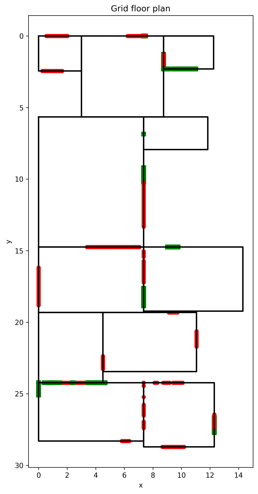
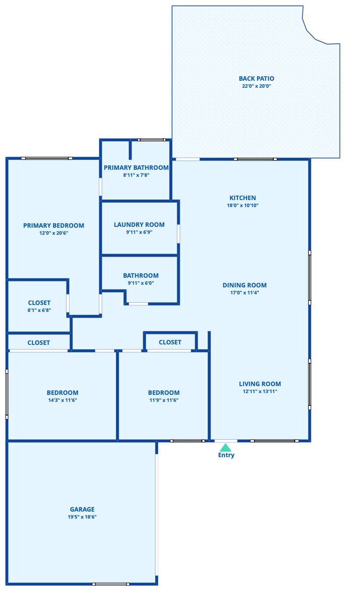

# 2D Floor Generation of Residential Homes from Panoramic Views

### Ross Volkov, Pouya Parsa, Dylan Blake, James Johnson
#### Final Project for CSCI 5561 - Computer Vision

This repository implements a pipeline for converting 360° panoramic images of indoor residential spaces into 3D reconstructions and 2D floor plans.

## Folder Overview

- **WallFitting/** — Line fitting and wall reconstruction code using RANSAC.
- **classification/** — Contains traditional classification pipeline using super-pixel segmentation.
- **dataset_utils/** — Scripts for filtering, processing, and extracting scenes from the ZInD dataset.
- **eval/** — Evaluation scripts (e.g., IoU calculation, overlay generation).
- **feature_matching/** — Includes SIFT and deep-learning-based feature matching for stereo reconstruction.
- **segmentation/** — Panorama-based segmentation tools using CLIPSeg and labeling utilities.
- **run.py/** — Main runner script for launching the reconstruction pipeline.

## Report
For detailed methodology, evaluation, and figures, see the accompanying LaTeX report in `report.pdf` or below.

## Floor Plan Example

Below are two visualizations from the floor plan reconstruction pipeline(right is the ground truth from Zillow indoor dataset):

  
  

**Left:** Automatically assembled layout using predicted room rectangles and openings.  
**Right:** Ground-truth floor plan from ZInD dataset.

